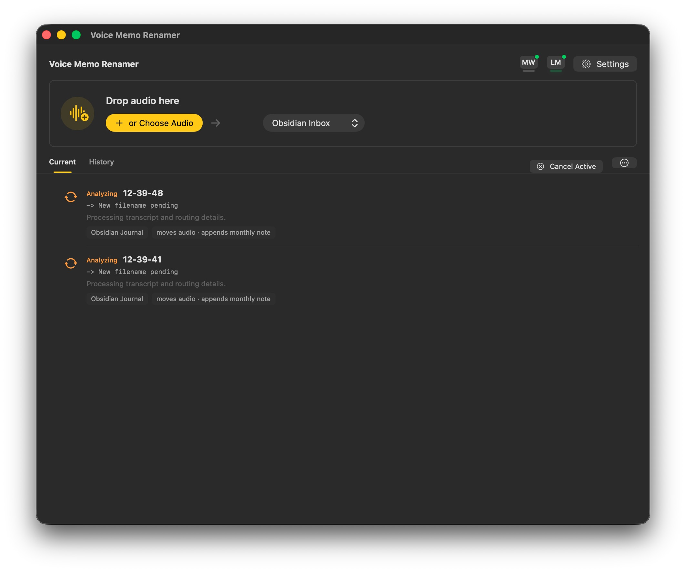
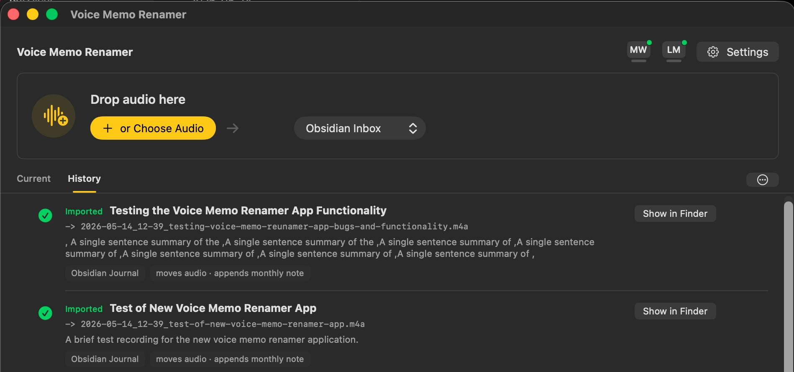
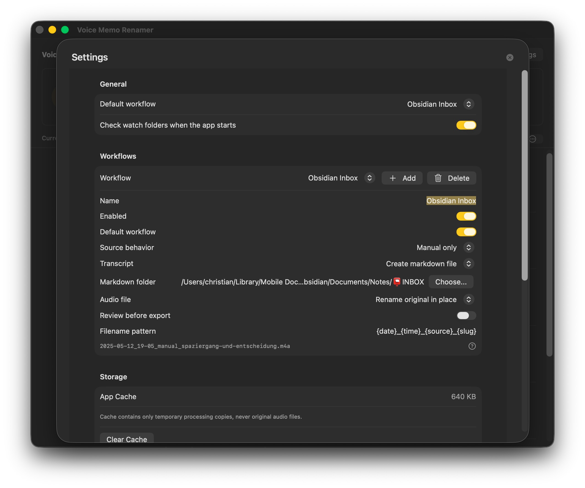

# Voice Memo Renamer

Voice Memo Renamer is a small native macOS app I built for my own voice-note workflow.

I often record quick thoughts, ideas, and spoken notes, then want them to end up in my Obsidian journal with useful filenames, a transcript, a short summary, and enough structure that I can find them again later. This app exists for that very specific need: take local audio files, transcribe them with MacWhisper, analyze the transcript with a local LM Studio model, and import the reviewed result into an Obsidian vault.

This is not a general-purpose transcription product yet. It is a personal workflow app that I am making public because it may be useful to others with a similar local-first setup, or as a starting point for their own version.

## Status

Version `1.0.0` is a first public release.

The app currently assumes:

- macOS 13 or newer.
- MacWhisper CLI is installed and available at `/usr/local/bin/mw`.
- LM Studio is running a local OpenAI-compatible endpoint at `http://localhost:1234/v1`.
- You use Obsidian, or you configure one of the non-Obsidian workflows in the app settings.
- You are comfortable with a source-available, private-use project that was built around one person's workflow.

## Screenshots

Current queue with transcription analysis in progress:



History view with imported voice memos:



Settings for workflows, storage, MacWhisper, and LM Studio:



## What It Does

- Drag and drop `.m4a`, `.mp3`, and `.wav` audio files.
- Copies audio into an app-managed local processing area.
- Runs MacWhisper CLI for transcription.
- Sends the transcript to LM Studio for local metadata generation.
- Lets you review the title, summary, workflow, date, transcript, and technical details.
- Imports approved memos into an Obsidian monthly journal note.
- Copies audio into the configured audio destination folder.
- Keeps local import history in:

```text
~/Library/Application Support/VoiceMemoRenamer/history.json
```

## Default Workflow

The default destination is `Obsidian Journal`.

By default, the exporter appends entries to:

```text
~/Library/Mobile Documents/iCloud~md~obsidian/Documents/Notes/🖋️ Journal/YYYY-MM.md
```

and copies audio to:

```text
~/Library/Mobile Documents/iCloud~md~obsidian/Documents/Notes/🖋️ Journal/Audio/
```

You can change workflows, destination folders, watch folders, filename patterns, and transcript/audio behavior in the app settings.

## Privacy

The app is designed for a local-first workflow:

- Audio processing happens on your Mac.
- Transcription is performed by MacWhisper CLI.
- Transcript analysis is sent to your local LM Studio server.
- Import history and temporary processing files are stored locally in Application Support.

The app does not intentionally send audio or transcripts to a cloud service. If your Obsidian vault lives in iCloud Drive or another sync provider, those files are handled by that provider after export.

## Requirements

- macOS 13 or newer.
- Xcode app toolchain for building from source.
- MacWhisper CLI.
- LM Studio with a loaded local model.
- Optional: Obsidian with an existing vault.

## Run The Downloaded App

For the `1.0.0` release, download the DMG from GitHub Releases and drag `Voice Memo Renamer.app` into Applications.

Because this app is currently distributed outside the Mac App Store and may not be notarized, macOS may show a security warning on first launch. If that happens, open it from Finder with Control-click, choose Open, and confirm that you want to run it.

Before importing files, open Settings and check:

- MacWhisper CLI path.
- LM Studio base URL.
- Loaded LM Studio model.
- Default workflow.
- Obsidian vault or destination folder paths.

## Build From Source

Use the Xcode app toolchain if Command Line Tools are selected:

```bash
DEVELOPER_DIR=/Applications/Xcode.app/Contents/Developer swift build
```

To build a launchable `.app` bundle:

```bash
Scripts/build-app.sh
```

Run the app bundle:

```bash
open -n .build/VoiceMemoRenamer.app
```

## Build The Release DMG

To build a release app and package it as a DMG:

```bash
Scripts/build-dmg.sh 1.0.0
```

The DMG is written to:

```text
dist/VoiceMemoRenamer-1.0.0.dmg
```

This script uses ad-hoc signing for local distribution. For broader public distribution, use a Developer ID certificate and notarization.

## Known Limitations

- Only tested on my own setup.
- MacWhisper CLI is the only transcription backend right now.
- LM Studio is the only analysis backend right now.
- The default workflow is opinionated around Obsidian, iCloud Drive, and monthly journal notes.
- First-run setup is still manual.
- Public binary distribution is not yet a polished notarized installer flow.

## Future Ideas

- Optional Micro Whisper support.
- Additional transcription backends.
- Setup assistant for first launch.
- More reusable workflow templates.
- Signed and notarized public releases.

## License

This project is source-available for private use. See [LICENSE](LICENSE).
