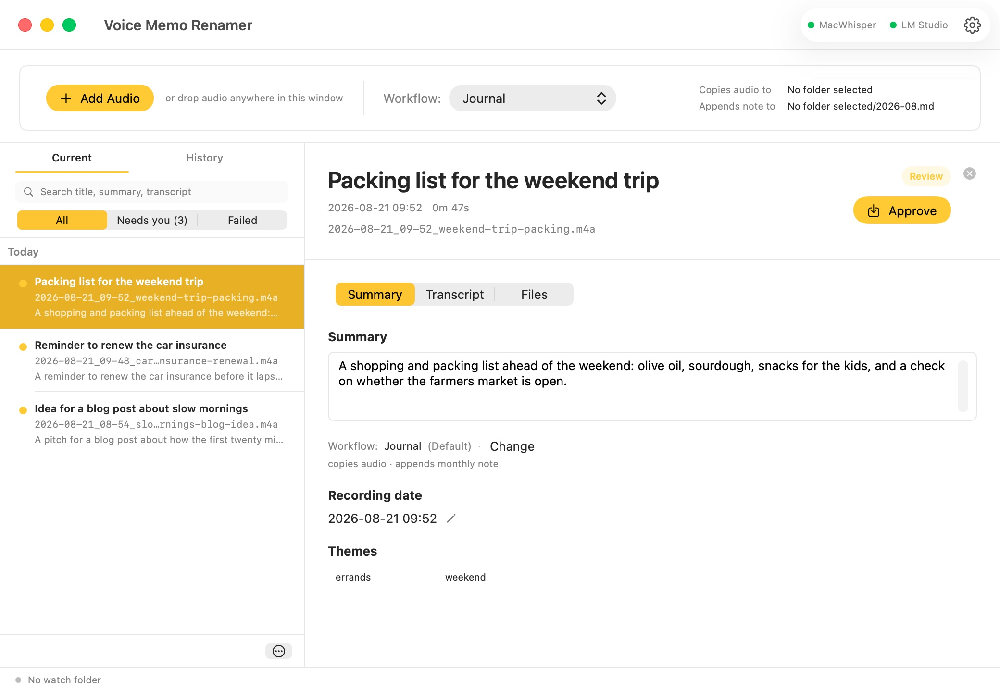
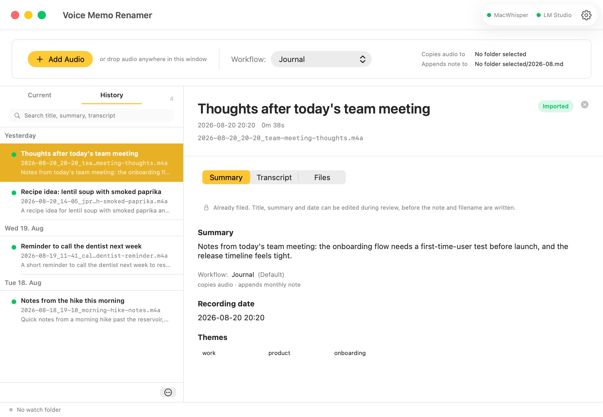
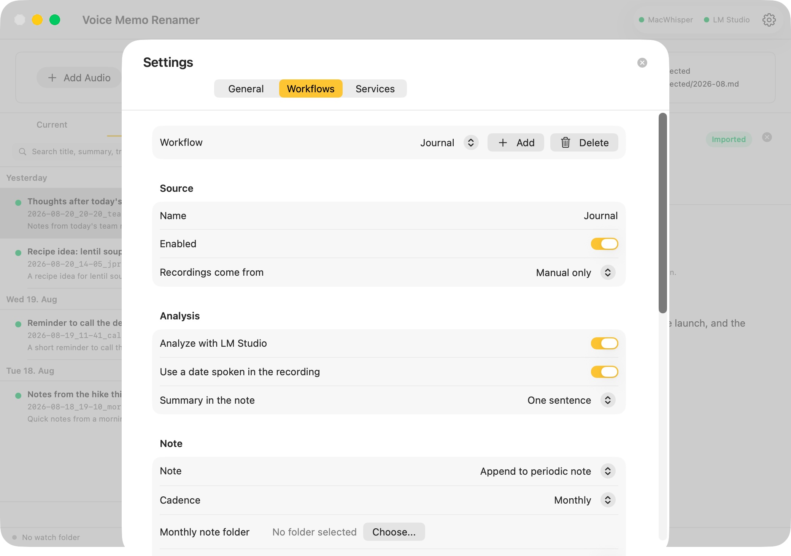

# Voice Memo Renamer

A simple voice memo transcription app for macOS that creates or appends Markdown notes — like your Obsidian journal. Intelligent filenames and summaries come from a local AI model via LM Studio, so nothing leaves your Mac.



## Get Started

**You'll need:**

- macOS 13 or newer.
- [MacWhisper](https://goodsnooze.gumroad.com/l/macwhisper) with its CLI installed — this does the transcription.
- [LM Studio](https://lmstudio.ai) with at least one model downloaded — this generates the title, filename, and summary. It's loaded automatically when needed.
- Optional: Obsidian, or any other Markdown-based notes app — neither is required.

**Install:**

1. Download the latest `.dmg` from [Releases](https://github.com/chprinz/Voice-Memo-Renamer/releases) and drag `Voice Memo Renamer.app` into Applications.
2. The app isn't notarized yet, so macOS will warn you on first launch. Control-click the app, choose **Open**, and confirm.
3. A setup assistant walks you through MacWhisper, LM Studio, and ffmpeg on first launch, auto-detecting what it can and letting you fix the rest inline. It won't guess where your notes should live — you can always re-run it from Settings → Services.
4. Pick a folder for the default **Journal** workflow's notes and audio in Settings → Workflows (or skip this — see below).
5. Drag an audio file onto the app and watch it get transcribed, analyzed, and imported.

Nothing is pre-filled with a personal folder or a specific notes app. Until you choose a folder for a workflow, its note and any copied audio are simply written next to the recording's own source file. Whether a workflow's note embeds audio with Obsidian's `![[wikilink]]` syntax or a plain `<audio>` tag that works in any Markdown app is set per workflow in Settings → Workflows (see [Choosing Where Notes Go](#choosing-where-notes-go) below).

## What It Does

- On first launch, a setup assistant auto-detects MacWhisper, ffmpeg, and LM Studio, checks each one is actually reachable, and lets you fix or locate anything it can't find — before you ever hit a confusing failure on your first import.
- Drag and drop audio: `.m4a`, `.m4b`, `.mp3`, `.wav`, `.wave`, `.w64`, `.aiff`, `.aif`, `.aifc`, `.caf`, `.flac`, `.aac`, `.opus`, `.ogg`, `.mp4`, `.mov`.
- Transcribes with MacWhisper CLI, then sends the transcript to LM Studio for local title/summary generation.
- Shows a review panel — title, summary, workflow, date, transcript — so you can move through several recordings before anything is written. Once imported, that panel becomes read-only.
- Can also skip AI analysis entirely per workflow, when a filename-based rename is all you need (see [Workflows Without Analysis](#workflows-without-analysis) below).
- Imports approved memos into your notes and copies the audio to your chosen folder, with optional compression or loudness normalization.
- Keeps local import history in `~/Library/Application Support/VoiceMemoRenamer/history.json`.

## Screenshots

<details>
<summary>History and Settings views</summary>

History view with imported voice memos:



Settings for workflows, storage, MacWhisper, and LM Studio:



</details>

## Privacy

The app is local-first:

- Audio processing happens on your Mac.
- Transcription is performed by MacWhisper CLI.
- Transcript analysis is sent to your local LM Studio server.
- Import history and temporary processing files are stored locally in Application Support.

The app does not intentionally send audio or transcripts to a cloud service. If your Obsidian vault lives in iCloud Drive or another sync provider, those files are handled by that provider after export.

## Advanced Configuration

<details>
<summary><strong>Choosing Where Notes Go</strong></summary>

Three workflow presets ship out of the box:

- **Journal** — appends to one shared note on a cadence you set (Settings → Workflows → Note → Cadence: Daily, Weekly, or Monthly). This is the default workflow.
- **Note per Recording** — writes a separate `.md` file for each import.
- **Rename Audio Only** — no note at all, just a renamed audio file.

None of them come with a folder pre-selected. Until you pick one (Settings → Workflows → the folder row under Note or Audio file), a workflow's note — and any audio it copies or moves — is written right next to the original recording's own file. That's a safe, zero-configuration default, not a bug: point a workflow at a real folder once you know where you actually want that kind of note to live.

**Embed audio in note** (Settings → Workflows → Note) is a per-workflow switch. On, the audio is referenced in the note; off, the note has no audio reference at all. When it's on and the workflow copies or moves the audio into the note's folder, an **Embed as** picker chooses the syntax: Obsidian's `![[wikilink]]`, which Obsidian and Logseq render as an inline player, or a plain `<audio controls>` tag, which most Markdown apps render as a player too and degrades to visible-but-harmless text in the few that don't render embedded HTML. If the workflow leaves the audio where it is instead of copying it, there's no same-folder filename to link to, so the note references the recording by its actual file path instead — that always works, regardless of where the file lives, but only as a plain `<audio>` tag (a wikilink can't reliably find a file outside the vault).

</details>

<details>
<summary><strong>Workflows Without Analysis</strong></summary>

Some recordings already carry their subject in the filename, and running them through
LM Studio only produces a worse name than the one you typed yourself. Each workflow
therefore has an **Analyze with LM Studio** switch under Settings → Workflows → Analysis.

With it off, the workflow transcribes and stops there. The title, slug, and filename
all come from the original filename, so importing takes as long as transcription and
nothing else. Pair it with a filename pattern built from `{date}` and `{filename}`:

```text
{date}_{filename}   →   2026-08-14_2012 Quanjihao Manzhuan.m4a
```

The two placeholders that reuse the original name are:

- `{filename}` — the original name, unchanged, so capitals and spaces survive.
- `{filenameSlug}` — the original name as a lowercase slug.

The pattern preview under the field shows a sample named `Original Filename.m4a`, so
you can see at a glance which part of the result comes from the source file. The full
placeholder list with explanations is behind the **?** button next to the preview.

Two more per-workflow switches control what the exported note looks like: whether it
starts with a bold title line, and whether the summary is written as one sentence,
as bullet points, or left out completely.

</details>

<details>
<summary><strong>Finding Things Again</strong></summary>

Recordings are grouped by day — Today, Yesterday, then the date — in both Current and
History, and the search field above the list matches the title, the summary and the
full transcript. That is usually the fastest way back to a recording: search a word you
know you said.

Current also carries a filter — All / Needs you / Failed — so a queue with one stuck
import does not hide the rest.

</details>

<details>
<summary><strong>Temporary Copies</strong></summary>

Audio dragged from an app that hands over data rather than a file is copied into the
app's own folder first. Settings → Services → Cache shows how much that folder holds,
and **Delete** decides when copies go: by default once the recording is imported, which
is also when a copy stops being needed. A copy is only ever deleted if the audio
verifiably exists somewhere else, so a workflow that leaves audio in place keeps its
copy.

</details>

<details>
<summary><strong>Dates Spoken In The Recording</strong></summary>

File timestamps are frequently wrong, because copying or syncing a recording rewrites
them. When a workflow has **Use a date spoken in the recording** enabled (Settings → Workflows → Analysis), a
date stated at the very beginning or end of a memo takes priority over the file's own
date. Only explicitly written out dates count (`14.08.2026`, `14. August 2026`,
`2026-08-14`, `August 14, 2026`), optionally with a clock time next to them.

Where the date came from is shown in the review panel under the date picker, and you
can always overrule it there.

</details>

<details>
<summary><strong>Audio Processing Options</strong></summary>

Both live per workflow, under Settings → Workflows → Audio file: **Normalize** and **Compress**. They're per-workflow rather than global so one workflow (say, a noisy watch folder fed by a wireless lav mic) can normalize aggressively while another (clean manual recordings) leaves audio untouched. They apply whenever that workflow actually produces an export copy (audio file behavior "Copy audio to folder" or "Move audio to folder"); a workflow that leaves audio in place or renames in place is unaffected. The original source file is never modified — only the exported copy is affected.

- **Normalize (-16 LUFS)**: two-pass EBU R128 loudness normalization (`ffmpeg`'s `loudnorm` filter, target -16 LUFS / -1.5 dBTP / LRA 11) at the source's own sample rate. It runs **before transcription**, because a quiet recording is harder for MacWhisper to read, and the same normalized copy is then reused for the exported audio — `loudnorm` never runs twice. Useful for recorders (e.g. wireless lav mics) whose raw levels vary a lot. Requires `ffmpeg`; its path is configurable under Settings → Services and defaults to `/opt/homebrew/bin/ffmpeg`, and with normalization on, a missing `ffmpeg` stops the import before transcription rather than after it.
- **Compress**: runs at export only, on the exported copy. Re-encodes the exported copy to AAC/M4A at the source sample rate, via the built-in `afconvert`. Bitrate (32–256 kbps) and mono vs. source channels are set alongside it, in the same Audio file section. M4A sources that are already below twice the target bitrate are left untouched to avoid a quality-losing second encode.

So the full order is: normalize → transcribe → analyze → review → compress → export. The
normalized copy lives in the processing cache and is deleted once the import succeeds.

Separately from all of this, audio in unusual sample formats — 32 bit float WAV from
wireless field recorders, for instance — is converted to plain 16 bit PCM in the cache
before transcription, and converted again as a retry if MacWhisper rejects a file. That
conversion only ever feeds the transcriber. With normalization on it is usually not
needed at all, since the normalized copy is already plain PCM.

</details>

## Build From Source

<details>
<summary>Building and packaging the app yourself</summary>

Use the Xcode app toolchain if Command Line Tools are selected:

```bash
DEVELOPER_DIR=/Applications/Xcode.app/Contents/Developer swift build
```

To build a launchable `.app` bundle:

```bash
Scripts/build-app.sh
```

Run the app bundle:

```bash
open -n .build/VoiceMemoRenamer.app
```

To build a release app and package it as a DMG:

```bash
Scripts/build-dmg.sh 1.6.0
```

The DMG is written to `dist/VoiceMemoRenamer-1.6.0.dmg`. This script uses ad-hoc signing for local distribution. For broader public distribution, use a Developer ID certificate and notarization.

**Requirements:** Xcode app toolchain for building from source, in addition to the runtime requirements above.

</details>

## About This Project

Version `1.6.0`. First public release was `1.0.0`.

I built this for my own voice-note workflow — recording quick thoughts and getting them into Obsidian with a good filename, a transcript, and a short summary. It's not a general-purpose transcription product; it's a personal workflow app made public because it may be useful to others with a similar local-first setup, or as a starting point for their own version.

**Known limitations:**

- Only tested on my own setup.
- MacWhisper CLI is the only transcription backend right now.
- LM Studio is the only analysis backend right now.
- Import history is written to disk on the main thread, so very large histories will eventually feel sluggish.
- Public binary distribution is not yet a polished notarized installer flow.

**Future ideas:** additional transcription backends, more reusable workflow templates, signed and notarized public releases.

## License

This project is source-available for private use. See [LICENSE](LICENSE).
